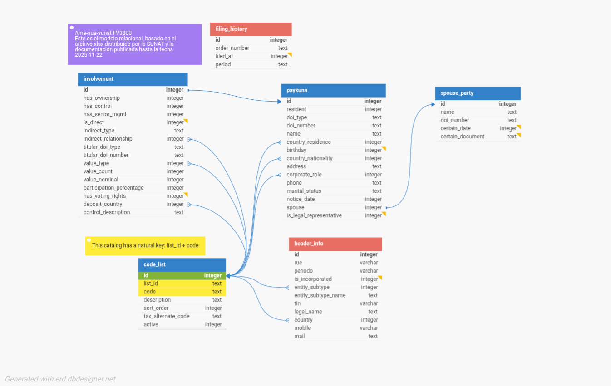

# Notas sobre el modelo de datos

El modelo está diseñado para una **base de datos embebida**, ligera y portable.  
Para este proyecto se ha elegido **SQLite** por simplicidad, velocidad y facilidad de despliegue.

## 📘 Modelo de datos

### header_info
Información principal del declarante: RUC, período, naturaleza jurídica, país, datos de contacto.

### filing_history
Historial mínimo de declaraciones anteriores, útil para trazabilidad y exportación del último período declarado.

### code_list
Catálogo universal parametrizable: países, parentescos, roles corporativos, tipos de valor, etc.

### spouse_party
Información del cónyuge/pareja de unión de hecho. Incluye nombre y permite adjuntar PDF de sustento.

### paykuna
Entidad que representa a cualquier persona natural o jurídica involucrada en la declaración.

### involvement
Describe la relación entre un paykuna y la empresa: propiedad, control, dirección, valores, derechos de voto, etc.

---

## 🌱 Seeds (Catálogos iniciales)

El script `.sql` contiene `INSERT` statements con todos los catálogos requeridos.

---

## 🌍 Nota especial sobre el catálogo de países

El catálogo SUNAT está desactualizado, contiene países desaparecidos y omite países existentes.  
Este proyecto utiliza un catálogo actualizado con un campo `tax_alternate_code` para compatibilizarse con el FV3800.

### Casos relevantes:
1. Serbia y Montenegro (CS) ya no existe desde 2006 → RS / ME  
2. Antillas Neerlandesas (AN) disueltas en 2010 → CW / SX / BQ  
3. Kosovo (XK) independiente desde 2008  
4. Saint Barthélemy (BL) separado de Guadalupe en 2007  
5. Saint Martin – parte francesa (MF)

---

## ❓ Seeds – Preguntas frecuentes

### ¿Es compatible con SUNAT FV3800?
Sí, completamente. `tax_alternate_code` permite exportar usando los códigos legacy SUNAT.

### ¿Por qué tanto esfuerzo?
Porque la informática existe **para servir al usuario**, no para cuadricularlo ni adaptarlo a las limitaciones de un formulario viejo.

Desde la pascalina de Blaise Pascal, las computadoras nacieron para **aliviar trabajo humano**, no para imponerlo.

---

## Manifiesto InfoYupay

Negar la existencia de un país es negar la existencia de su gente.  
Un software libre debe respetar tanto la libertad del código como la libertad de las personas.

Imagina viajar al extranjero y buscar tu nacionalidad…
y que en la lista no aparezca **Perú**, sino “Confederación Peruano-Boliviana”.

¿Te molestaría? ¿Te heriría?
¿Te sentirías invisible ante el sistema?

Negar la existencia de un pueblo es un acto de violencia cultural.

Por eso, en este proyecto:

- respetamos la autodeterminación,
- respetamos los hechos geopolíticos,
- y respetamos al usuario.

El software libre no solo se trata de licencias.
También se trata de libertad en el mundo real.

Este proyecto honra ambas.

Y además:

- corrige anacronismos,  
- respeta la realidad geopolítica,  
- y brinda ergonomía al usuario sin perder compatibilidad con SUNAT.
